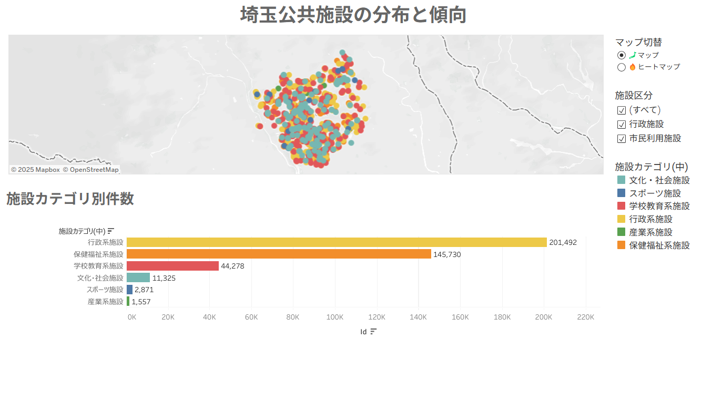

# 🗾 埼玉県公共施設ダッシュボード



## プロジェクト概要
Tableau Publicを用いて、埼玉県内の公共施設分布とカテゴリ傾向を可視化しました。
以下を目的としています：

- 施設の種類ごとの分布を地図で把握
- ヒートマップにより密集地域を一目で確認
- カテゴリ別件数を棒グラフで比較

---

## 🔍 使用ツール
- Tableau Public（ダッシュボード作成）
- Python（前処理：pandas）
- GitHub（ポートフォリオ管理）

---

## 📂 フォルダ構成
```
saitama_public_facilities_map/
├── data/                     # データフォルダ（元データまたはサンプル）
├── cleaning_saitama.ipynb   # 前処理ノートブック
├── index.html               # Tableau ダッシュボード埋め込みページ
├── thumbnail.png            # README トップ画像
└── README.md                # このファイル
```

## 🗺️ ダッシュボード構成
| セクション | 内容 |
|------------|------|
| 🧭 マップ / ヒートマップ切替 | パラメータで切替可能（🗺️ / 🔥）|
| 📊 施設カテゴリ別件数 | 棒グラフ表示（横向き）|
| 🎯 フィルター | 施設区分・カテゴリで絞り込み |

---

## 🔖 補足メモ
- 色は凡例統一のため、手動で同一に設定済み
- フィルター「すべて」は削除し、初期状態で全選択

---